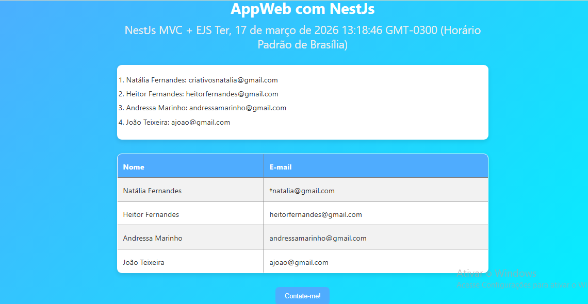
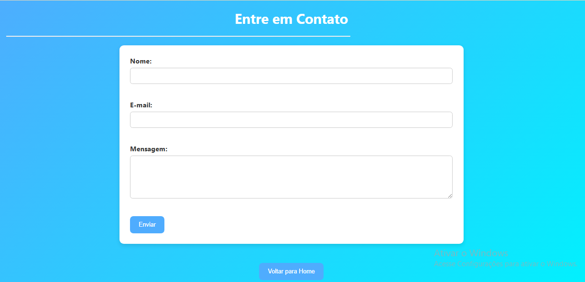

# 🚀 Projeto NestJS MVC + EJS

Este é um projeto web desenvolvido utilizando o framework NestJS com padrão MVC e template engine EJS.

## 📌 Funcionalidades

- 📄 Página inicial com listagem de usuários
- 📬 Página de contato com formulário
- 🔁 Navegação entre páginas
- 🎨 Estilização com CSS

## 🛠️ Tecnologias utilizadas

- Node.js
- NestJS
- EJS
- HTML5
- CSS3

## ▶️ Como executar o projeto

```bash
# Instalar dependências
npm install

# Rodar o projeto
npm run start

Acesse no navegador:
http://localhost:3000

📂 Estrutura do projeto
src/
views/
public/

📸 Preview

## 📸 Preview





👩‍💻 Autor

Natália Fernandes